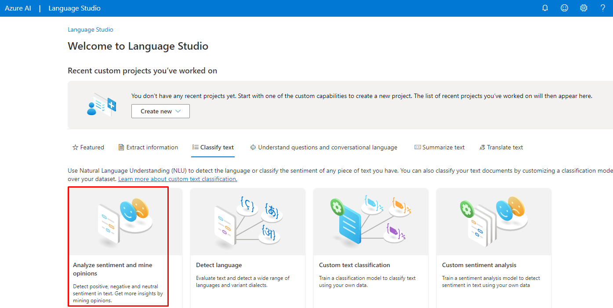
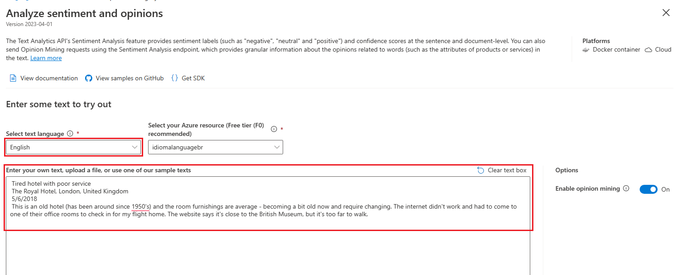
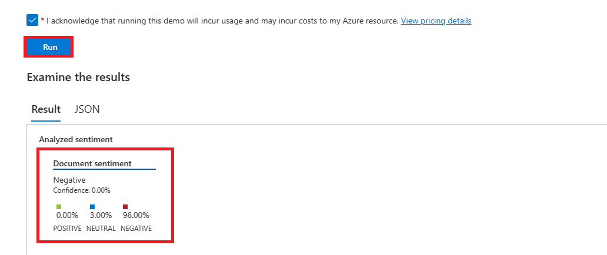
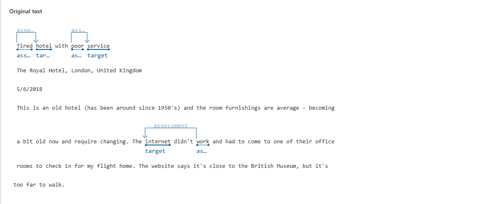

<h1>
    
     
Análise de Sentimentos com Language Studio 
</h1>

## Analyze sentiment and mine opinions
Através deste recurso a Inteligência Artificial analiza textos afim de descobrir o sentimento e satisfação do usuário que o escreveu, assim como as principais opiniões.

### 01 - Dentro do Language Studio guia *Classify test* clique na opção Analyze sentiment and mine opinions:   
 

...

 
...
 
...
 
...

## Considerações Finais  

Esse recurso permite às empresas entender rapidamente o sentimento dos clientes em relação aos seus produtos e serviços. Isso possibilita uma reação ágil por parte da empresa, considerando o que os clientes gostaram ou não gostaram, bem como a possibilidade de retorno para futuras compras.

